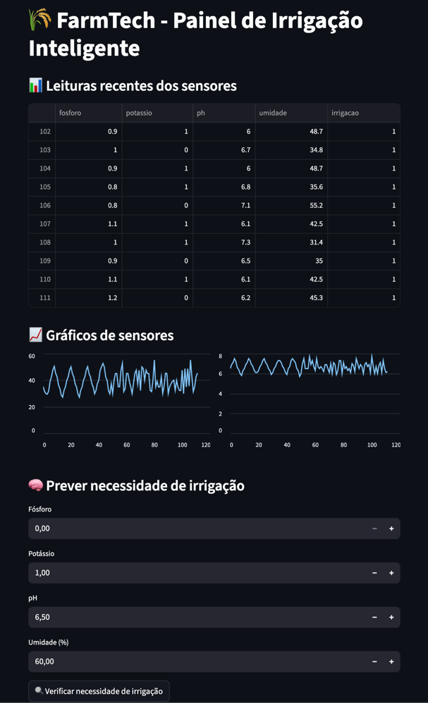

# FIAP - Faculdade de Informática e Administração Paulista

## 📌 Nome do projeto
**FarmTech Solutions — Sistema de Irrigação Inteligente com Monitoramento de Nutrientes e Ambiente**

## Nome do Grupo

FarmTech Solutions

## 👨‍🎓 Integrantes:
- Italo Domingues – RM: 561787
- Maison Wendrel Bezerra Ramos – RM: 565616
- Jocasta de Kacia Bortolacci – RM: 564730

## 👩‍🏫 Professores:

**Tutor(a):**  
Lucas Gomes Moreira

**Coordenador(a):**  
André Godoi Chiovato

---

## 📜 Descrição

### Entrega 3: Inteligência Artificial, Dashboard e Otimizações

Na Fase 4, o projeto FarmTech Solutions foi aprimorado com recursos de Machine Learning, visualização interativa e melhorias na simulação do hardware:

- Criação de modelo preditivo com **Scikit-learn** (`RandomForestClassifier`) para prever automaticamente a necessidade de irrigação;
- Desenvolvimento de dashboard interativo com **Streamlit**, exibindo os dados dos sensores em tempo real, gráficos e predições;
- Leitura de dados reais via banco de dados ou simulação por `.csv`, incluindo sensores de Fósforo, Potássio, pH e Umidade;
- Preparação do circuito no **Wokwi** com integração ao **Display LCD I2C** (SDA/SCL) para exibição de métricas no ESP32;
- Otimização do código C/C++ com foco em uso eficiente de memória e comentários justificando cada alteração;
- Implementação do **Serial Plotter** no Wokwi para monitoramento visual de variáveis (como umidade).

Essas melhorias levam o sistema a um novo nível, com inteligência, autonomia e uma interface de monitoramento mais robusta.

---

## 📹 Vídeo de Demonstração

[Clique aqui para assistir ao vídeo no YouTube](https://youtu.be/P2q3aN5mBUo)

---

## 🔧 Como executar o projeto

### ✅ Pré-requisitos

#### Para o Circuito (Wokwi):
- ESP32
- Sensor DHT22
- Simulação de pH (LDR)
- Botões para Fósforo e Potássio
- LED representando bomba de irrigação
- Display LCD I2C (com SDA/SCL)
- Serial Plotter habilitado
- Código otimizado no Wokwi com variáveis ajustadas para uso eficiente de memória

#### Para o Dashboard com IA:
- Python 3.8 ou superior
- Bibliotecas:
   - `pandas`
   - `scikit-learn`
   - `joblib`
   - `matplotlib`
   - `streamlit`
- Arquivo `modelo_irrigacao.pkl` já treinado
- Arquivo `dataset_balanceado.csv` com histórico de leituras ou conexão com banco

---

### 🚀 Passo a passo

#### Para o Dashboard com Streamlit:
1. Certifique-se de que o arquivo `modelo_irrigacao.pkl` está na raiz do projeto.
2. Certifique-se de ter os dados em `dataset_balanceado.csv` ou carregue via banco.
3. Execute o dashboard com: streamlit run dashboard.py

#### Para o Circuito no Wokwi:
1. Acesse o projeto no Wokwi via link do grupo.
2. Verifique a conexão do display LCD I2C nos pinos SDA/SCL.
3. Suba o código otimizado no ESP32.
4. Abra o **Serial Monitor** e **Serial Plotter** para acompanhar as leituras em tempo real.
5. Interaja com os botões para alterar os valores dos sensores e observe a ativação da bomba e as leituras no LCD.

---

## 🖼️ Imagens do Projeto

### Circuito ESP32

### Dashboard Streamlit

---

## 🗃 Histórico de lançamentos

| Versão | Data       | Descrição                                                                                           |
|--------|------------|-----------------------------------------------------------------------------------------------------|
| 1.0    | 20/05/2025 | Implementação do circuito de simulação com ESP32 e Implementação do banco de dados e operações CRUD |
| 2.0    | 20/06/2025 | Integração de IA com Scikit-learn, visualização via Streamlit e otimizações no código ESP32         |

---

## 📋 Licença

MODELO GIT FIAP por FIAP está licenciado sob a licença [Attribution 4.0 International](https://creativecommons.org/licenses/by/4.0/).