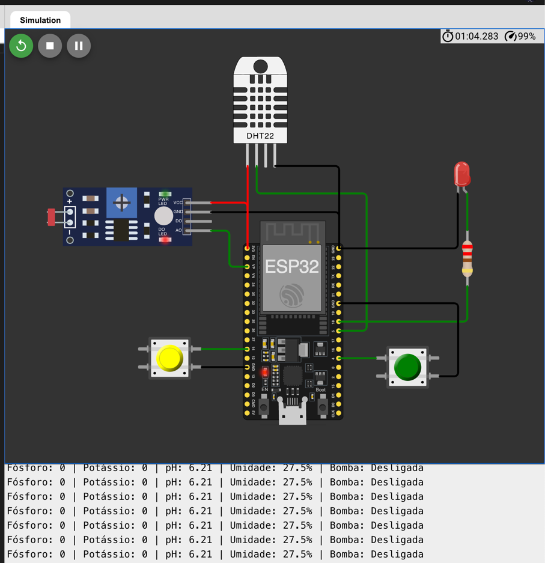
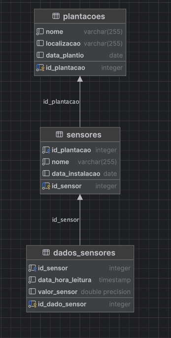

# FIAP - Faculdade de Informática e Administração Paulista

## 📌 Nome do projeto
**FarmTech Solutions — Sistema de Irrigação Inteligente com Monitoramento de Nutrientes e Ambiente**

## Nome do Grupo

FarmTech Solutions

## 👨‍🎓 Integrantes:
- Italo Domingues – RM: 561787
- Maison Wendrel Bezerra Ramos – RM: 565616
- Jocasta de Kacia Bortolacci – RM: 564730

## 👩‍🏫 Professores:

**Tutor(a):**  
Lucas Gomes Moreira

**Coordenador(a):**  
André Godoi Chiovato

---

## 📜 Descrição

### Entrega 1: Circuito de Simulação

A automação de sistemas agrícolas é uma necessidade crescente no setor agroindustrial, visando maior eficiência no uso de recursos hídricos e nutrientes. O **FarmTech Solutions** é um projeto baseado em **ESP32** que simula um sistema de irrigação inteligente, capaz de monitorar:

- Presença de nutrientes essenciais (Fósforo e Potássio);
- Simulação de pH do solo utilizando um sensor LDR;
- Nível de umidade relativa do ar com sensor DHT22.

O sistema **aciona automaticamente uma bomba de irrigação** (simulada com um LED) quando três condições são simultaneamente atendidas:

1. Presença de pelo menos um nutriente.
2. pH dentro da faixa ideal (5.5 a 7.5).
3. Umidade abaixo de 40%.

Este projeto demonstra a aplicação de microcontroladores em sistemas agrícolas para otimizar processos de irrigação, reduzir o desperdício de água e melhorar a produtividade.

### Entrega 2: Modelo Entidade-Relacionamento e Operações CRUD

Para a segunda entrega do projeto, desenvolvemos um Modelo Entidade-Relacionamento (MER) que representa a estrutura de dados necessária para o funcionamento completo do sistema FarmTech Solutions. O MER foi elaborado considerando os seguintes aspectos:

1. **Gerenciamento de Sensores**: Armazenamento de informações sobre os sensores utilizados, incluindo tipo, localização e estado de funcionamento.

2. **Registro de Leituras**: Armazenamento histórico das leituras de todos os sensores, permitindo análise temporal dos dados.

3. **Controle de Irrigação**: Registro dos ciclos de irrigação, incluindo duração, quantidade de água utilizada e motivo do acionamento.

4. **Gerenciamento de Culturas**: Informações sobre as culturas plantadas, incluindo necessidades específicas de nutrientes e água.

5. **Relatórios e Análises**: Estrutura para geração de relatórios de eficiência e sugestões de melhorias no sistema.

O MER serve como base para o desenvolvimento do banco de dados relacional que suportará todas as operações do sistema.

#### Operações CRUD Implementadas

Foram desenvolvidas operações CRUD (Create, Read, Update, Delete) para todas as entidades principais do sistema:

**1. Sensores**
- **Create**: Cadastro de novos sensores no sistema
- **Read**: Consulta de informações sobre sensores instalados
- **Update**: Atualização de dados como calibração e estado de funcionamento
- **Delete**: Remoção de sensores obsoletos ou danificados

**2. Leituras de Sensores**
- **Create**: Registro automático de novas leituras
- **Read**: Consulta de histórico de leituras com filtros por período e tipo de sensor
- **Update**: Correção de leituras com erro
- **Delete**: Remoção de leituras identificadas como anômalas

**3. Ciclos de Irrigação**
- **Create**: Registro de novos ciclos de irrigação
- **Read**: Consulta do histórico de irrigações
- **Update**: Ajuste de parâmetros de ciclos de irrigação
- **Delete**: Remoção de registros incorretos

**4. Culturas**
- **Create**: Cadastro de novas culturas e suas necessidades
- **Read**: Consulta de informações sobre culturas cadastradas
- **Update**: Atualização de parâmetros ideais para cada cultura
- **Delete**: Remoção de culturas não mais utilizadas

---

## 🔧 Como executar o projeto

### ✅ Pré-requisitos

- ESP32 DevKit
- Sensor DHT22
- Módulo LDR
- 2 Botões (push buttons)
- LED e resistor
- Jumpers e protoboard
- IDE Arduino instalada
- Biblioteca `DHT.h` instalada

### 🚀 Passo a passo

1. Monte o circuito conforme o diagrama fornecido.
2. Faça o upload do código `farmtech_solutions.ino` para o ESP32 utilizando a IDE Arduino.
3. Abra o **Monitor Serial** na IDE, configurado a **115200 bps**, para visualizar os dados de sensores e o estado da bomba.
4. Interaja com os botões para simular a presença de nutrientes e varie a luminosidade do LDR para simular diferentes níveis de pH.
5. Observe o acionamento automático do LED conforme as condições são atendidas.

---

## 🗃 Histórico de lançamentos

| Versão | Data       | Descrição                                   |
|--------|------------|---------------------------------------------|
| 1.0    | 20/05/2025 | Primeira versão funcional do sistema FarmTech Solutions |
| 2.0    | 15/06/2025 | Implementação do banco de dados e operações CRUD |

---

## 📋 Licença

MODELO GIT FIAP por FIAP está licenciado sob a licença [Attribution 4.0 International](https://creativecommons.org/licenses/by/4.0/).

